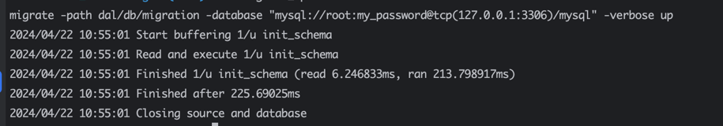
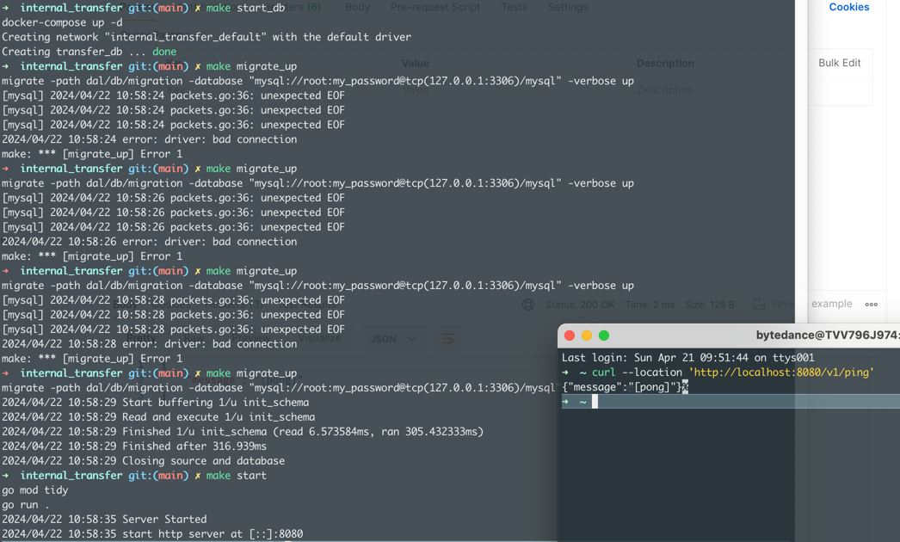
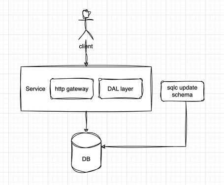
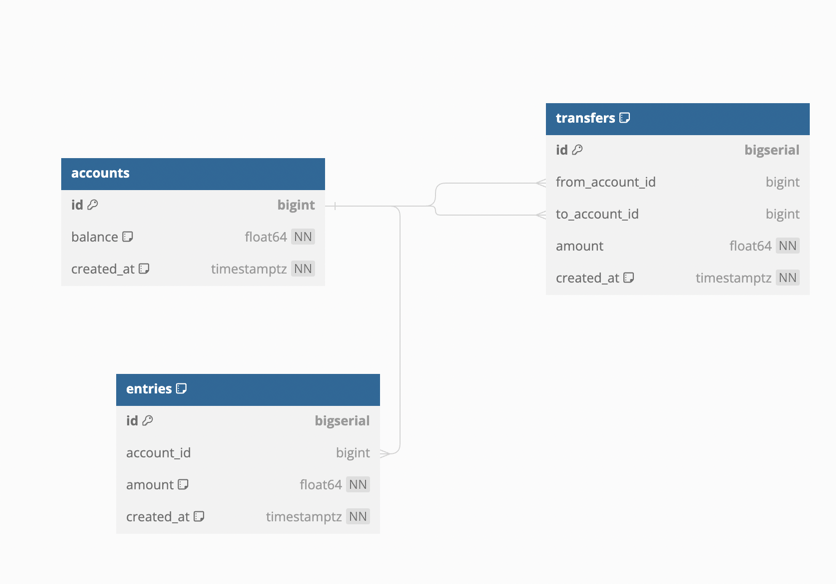
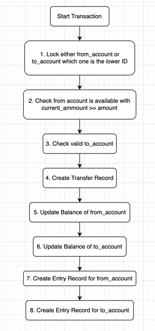

# internal_transfer
Exercise: Internal transfers System with an HTTP Interface
## Quick Start
0. Environment Requirement
  - Install [Docker](https://docs.docker.com/get-docker/)
  - Install [Docker Compose](https://docs.docker.com/compose/install/)
  - Install [Go](https://golang.org/doc/install)
1. Start DB container
  ```
  make start_db
```
 - SQL port 127.0.0.1:3306
 - client: root
 - password: my_password
2. Initialize DB
```
  make migrate_up
```
Makre sure log show up is success.

If have some connection errors. Please wait and check DB connection.
3. Start API server
```
  make start_api
```

example log success:

## Requirement
- Internal transfers application that facilitates financial
  transactions between accounts.
```azure
Consider the currency is the same for all accounts.
* Consider security is not an issue, no need to implement authn or authz
```
- Functional Specifications:
  - HTTP Interface:
    - Create an account
    - Get an account
    - Transfer money between accounts

## Design
### Overview Design

### SQL create table

#### SQL create table
```
CREATE TABLE `accounts` (
                            `id` bigint PRIMARY KEY,
                            `balance` double NOT NULL COMMENT 'must be positive',
                            `created_at` timestamp NOT NULL DEFAULT (CURRENT_TIMESTAMP)
);

CREATE TABLE `entries` (
                           `id` bigint PRIMARY KEY AUTO_INCREMENT,
                           `account_id` bigint,
                           `amount` double NOT NULL COMMENT 'can be negative and positive',
                           `created_at` timestamp NOT NULL DEFAULT (CURRENT_TIMESTAMP)
);

CREATE TABLE `transfers` (
                             `id` bigint PRIMARY KEY AUTO_INCREMENT,
                             `from_account_id` bigint,
                             `to_account_id` bigint,
                             `amount` double NOT NULL,
                             `created_at` timestamp NOT NULL DEFAULT (CURRENT_TIMESTAMP)
);

CREATE INDEX `accounts_index_0` ON `accounts` (`id`);

CREATE INDEX `entries_index_0` ON `entries` (`account_id`);

CREATE INDEX `transfers_index_1` ON `transfers` (`from_account_id`);

CREATE INDEX `transfers_index_2` ON `transfers` (`to_account_id`);

CREATE INDEX `transfers_index_3` ON `transfers` (`from_account_id`, `to_account_id`);

ALTER TABLE `entries` ADD FOREIGN KEY (`account_id`) REFERENCES `accounts` (`id`);

ALTER TABLE `transfers` ADD FOREIGN KEY (`from_account_id`) REFERENCES `accounts` (`id`);

ALTER TABLE `transfers` ADD FOREIGN KEY (`to_account_id`) REFERENCES `accounts` (`id`);
```

### API Design
#### Create an account
```
message CreateAccountRequest {
  int64 id = 1;
  double balance = 2;
}

message CreateAccountResponse {
  int64 code = 1;
  string message = 2;
}
```

#### Get an account
```
message GetAccountRequest {
  int64 id = 1; // from params
}

message GetAccountResponse {
  int64 code = 1;
  string message = 2;
  GetAccountResponseData data = 3;
}

message GetAccountResponseData {
  Account account = 1;
}

message Account {
  int64 id = 1;
  double balance = 2;
}
```

#### Transfer money between accounts
```
message TransferRequest {
    int64 from_account_id = 1;
    int64 to_account_id = 2;
    double amount = 3;
}

message TransferResponse {
    int64 code = 1;
    string message = 2;
}
```
#### Data flow

#### SQL
```
1. select id from accounts where id = ? for update;
2. select id from accounts where id = ? and balance >= ? for update;
3. select id from accounts where id = ? for update;
4. insert into transfers (from_account_id, to_account_id, amount) values (?, ?, ?);
5. update accounts set balance = balance - ? where id = ?;
6. update accounts set balance = balance + ? where id = ?;
7. insert into entries (account_id, amount) values (?, ?);
8. insert into entries (account_id, amount) values (?, ?);
commit
```
### API
```

service InternalTransfer{
  rpc CreateAccount(CreateAccountRequest) returns (CreateAccountResponse) {
    option (google.api.http) = {
      post: "/v1/account"
      body: "*"
    };
  }

  rpc GetAccount(GetAccountRequest) returns (GetAccountResponse) {
    option (google.api.http) = {
      get: "/v1/account/{id}"
    };
  }

  rpc Transfer(TransferRequest) returns (TransferResponse) {
    option (google.api.http) = {
      post: "/v1/transfer"
      body: "*"
    };
  }
}

```

## Testing
### CRUD
1. Create account
```
curl --location 'http://localhost:8080/v1/account' \
--header 'Content-Type: application/json' \
--data '{
    "id": 1,
    "balance": 100
}'
```

2. Get account
```
curl --location 'http://localhost:8080/v1/account/1'
```
3. Make a transfer
```
curl --location 'http://localhost:8080/v1/transfer' \
--header 'Content-Type: application/json' \
--data '{
    "from_account_id": 2,
    "to_account_id": 1,
    "amount": 100
}'
```

### DB access
1. access mysql container
``` 
docker exec -it transfer_db mysql -uroot -pmy_password
```

### Unit test
```
make test
```

## Future Work
1. Complete the CURD operations related to accounts, entries, transfers
